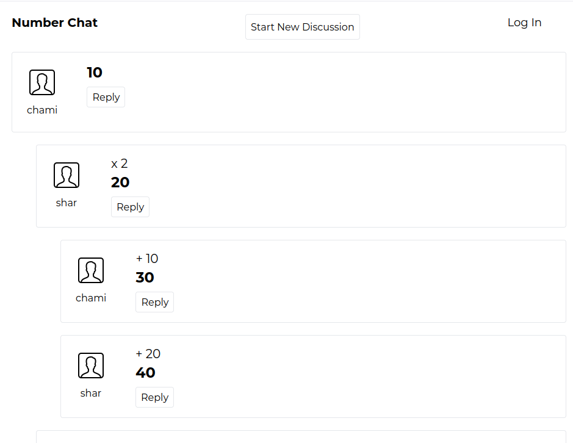

# Num-Chat

### Fun chat app where you do mathematics as chat. Deep nested replies that changes the outcome

Home page contains a simple page selector, something I created for a test. Use `Go to Chat` link go to chat page

## Environment tested on
- node v20
- postgresql v13.16

## How to use

1. clone the app from GitHub
2. rename file `sample.env.local` in project root folder to `.env.local`
3. go to project folder and open a new terminal
4. run: `openssl rand -base64 32` to generate secret for next auth and paste it in the `env.local` file
5. save your database configurations in `env.local` 
6. run: `npm install` to install dependencies
7. run: `npm run migrate` to create tables on db
8. run: `npm run seed` to put some initial data to start with
9. run: `npm run dev` to run the App. Enjoy!

### Screenshot

